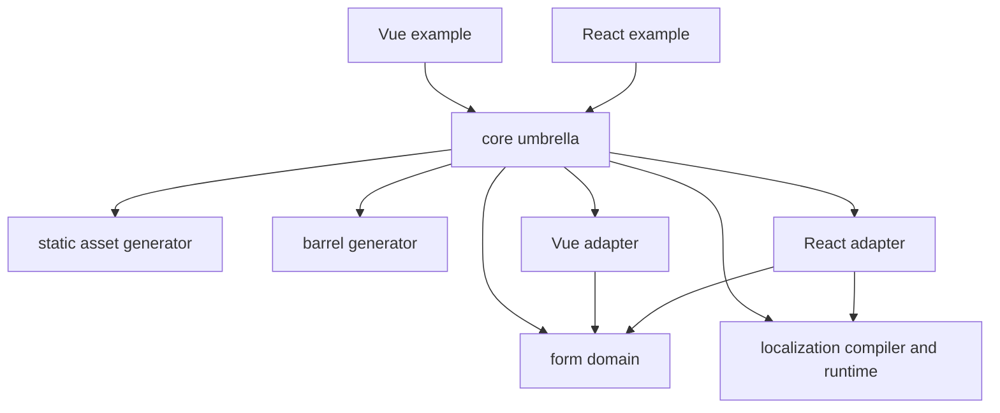

# Architecture

`valfuse-node` is a TypeScript monorepo for reusable form validation,
localization, static asset tooling, and TypeScript barrel generation. It is built with npm workspaces and Turborepo. The
examples under `packages/examples/` are private Vite applications used to
exercise the public APIs.

## Package responsibilities

| Workspace                         | Responsibility                                                                                       |
| --------------------------------- | ---------------------------------------------------------------------------------------------------- |
| `@valfuse-node/assets`            | Node.js CLI and API that generate typed TypeScript registries for static asset URLs                  |
| `@valfuse-node/barrel`            | Node.js CLI and API that generate selected TypeScript barrel files                                   |
| `@valfuse-node/form`              | Framework-agnostic schemas, rules, validation, value transformation, errors, and state types         |
| `@valfuse-node/localization`      | Node.js configuration, locale compiler and CLI, validators, generated artifacts, and browser runtime |
| `@valfuse-node/react`             | React form hook and controller, plus React localization provider, hooks, and storage strategies      |
| `@valfuse-node/vue`               | Vue form composable and Vue-specific form types                                                      |
| `@valfuse-node/core`              | Umbrella package with runtime root exports and explicit Node.js generator subpaths                   |
| `packages/examples/react-example` | Private React playground and integration reference                                                   |
| `packages/examples/vue-example`   | Private Vue playground and integration reference                                                     |

## Dependency direction

`form` owns form-domain rules and behavior. Framework adapters depend on that
domain package rather than the other way around. `core` is a facade only: it
contains no form or localization domain logic. The examples consume the
published-style umbrella entry point so they exercise the same API consumers
install.

`assets` and `barrel` are independent Node.js development tools. They have no
dependency on the form libraries. The core package depends on them only to
provide the explicit `@valfuse-node/core/assets` and
`@valfuse-node/core/barrel` API subpaths. The default core root entry does not
re-export or load either generator, keeping filesystem APIs out of the root
module graph. Their CLIs can also be installed and invoked directly.

## Public API boundaries

The `assets`, `barrel`, `form`, `localization`, `react`, and `vue` packages expose APIs
from their package entry points. Cross-package consumers should import from
package exports, never from another package's `src/` files. `core` re-exports the
framework-neutral APIs at the top level and renames the two form hooks to
`useReactValfuseForm` and `useVueValfuseForm` to avoid a name collision. The
adapter packages themselves continue to export `useValfuseForm`.

Localization has separate Node.js and browser entry points. The compiler and
CLI belong to the Node.js surface; interpolation and message lookup belong to
the browser runtime. The React package adds React-specific localization
integration. The Vue package currently focuses on forms and does not provide a
Vue localization provider.

For detailed public APIs, see the [package READMEs](./README.md#other-maintained-documentation).
